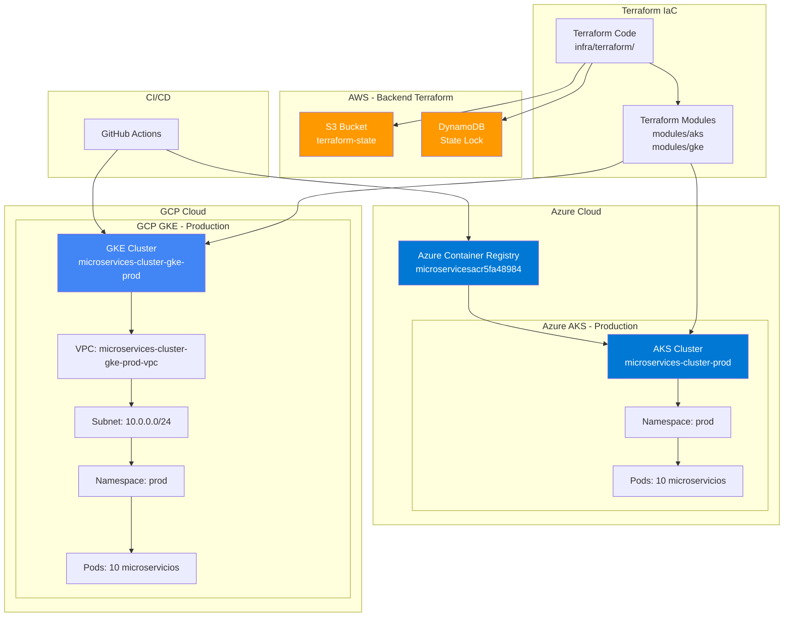

# 🌐 Arquitectura Multi-Cloud

## 📋 Resumen

Este documento describe la arquitectura multi-cloud implementada para el proyecto de microservicios, utilizando **Azure AKS** y **GCP GKE** como plataformas de orquestación de contenedores.

**HU**: HU 12 - Infraestructura Multi-Cloud y Terragrunt (8 SP)

---

## 🏗️ Diagrama de Arquitectura



---

## 🔧 Componentes de la Arquitectura

### 1. Backend Remoto (AWS)

**Ubicación**: AWS S3 + DynamoDB (us-east-2)

- **S3 Bucket**: `microservices-terraform-state-658250199880`
  - Almacena el estado de Terraform (`terraform.tfstate`)
  - Versionado habilitado
  - Cifrado SSE-S3
  
- **DynamoDB Table**: `terraform-state-lock`
  - Bloqueo de estado para prevenir conflictos
  - Modo PAY_PER_REQUEST

**Beneficios**:
- Estado centralizado y versionado
- Prevención de conflictos concurrentes
- Respaldo automático

---

### 2. Azure AKS (Azure Kubernetes Service)

**Cluster**: `microservices-cluster-prod`

**Configuración**:
- **Región**: `eastus2`
- **Node Pool**: `default`
  - **Nodos**: 2
  - **VM Size**: `Standard_D2s_v3` (2 vCPU, 8 GB RAM)
- **Identity**: SystemAssigned
- **DNS Prefix**: `microservices-prod`

**Recursos Desplegados**:
- **Namespace**: `prod`
- **Microservicios**: 10 servicios
  - api-gateway (2 réplicas)
  - cloud-config (2 réplicas)
  - service-discovery (2 réplicas)
  - order-service (2 réplicas)
  - payment-service (2 réplicas)
  - user-service (1 réplica)
  - product-service (1 réplica)
  - shipping-service (1 réplica)
  - favourite-service (1 réplica)
  - proxy-client (1 réplica)

**Container Registry**: `microservicesacr5fa48984.azurecr.io`

---

### 3. GCP GKE (Google Kubernetes Engine)

**Cluster**: `microservices-cluster-gke-prod`

**Configuración**:
- **Zona**: `us-central1-a`
- **Red**: VPC Nativa (`VPC_NATIVE`)
- **VPC**: `microservices-cluster-gke-prod-vpc`
- **Subnet**: `microservices-cluster-gke-prod-subnet` (10.0.0.0/24)
  - **Pods CIDR**: 10.1.0.0/16
  - **Services CIDR**: 10.2.0.0/16

**Node Pool**: `microservices-cluster-gke-prod-node-pool`
- **Nodos**: 2 (autoscaling: 1-3)
- **Machine Type**: `e2-medium` (2 vCPU, 4 GB RAM)
- **Disk**: 20 GB (pd-standard)
- **Auto-repair**: Habilitado
- **Auto-upgrade**: Habilitado

**Release Channel**: `REGULAR`

**Addons**:
- HTTP Load Balancing
- Horizontal Pod Autoscaling

---

### 4. Terraform Infrastructure as Code

**Estructura**:
```
infra/terraform/
├── main.tf              # Recursos principales
├── providers.tf         # Configuración de providers y backend
├── variables.tf        # Variables
├── outputs.tf          # Outputs
└── modules/
    ├── aks/            # Módulo para AKS
    │   ├── main.tf
    │   ├── variables.tf
    │   └── outputs.tf
    └── gke/            # Módulo para GKE
        ├── main.tf
        ├── variables.tf
        └── outputs.tf
```

**Providers Configurados**:
- `azurerm` (~> 4.0)
- `google` (~> 5.0)
- `aws` (~> 6.0) - Para backend S3
- `kubernetes` (~> 2.0)

---

## 🔄 Flujo de Trabajo

### 1. Desarrollo
```bash
# Modificar código Terraform
cd infra/terraform

# Planificar cambios
terraform plan

# Aplicar cambios
terraform apply
```

### 2. CI/CD
- **GitHub Actions** construye imágenes Docker
- Push a **Azure Container Registry**
- Despliegue automático a **AKS** y **GKE**

### 3. Gestión de Estado
- Estado almacenado en **S3**
- Bloqueo gestionado por **DynamoDB**
- Prevención de conflictos concurrentes

---

## 🔐 Seguridad

### RBAC (Role-Based Access Control)
- **ServiceAccounts** dedicados para cada microservicio
- **Roles** con permisos mínimos necesarios
- **RoleBindings** vinculando ServiceAccounts a Roles

### Network Policies
- Aislamiento de red por namespace
- Comunicación controlada entre servicios

### Secrets Management
- **Kubernetes Secrets** para credenciales
- Referencias desde Deployments via `valueFrom`

---

## 📊 Distribución de Cargas

### Azure AKS (Producción Principal)
- **Propósito**: Entorno de producción principal
- **Carga**: 100% de tráfico de producción
- **Alta Disponibilidad**: 2 réplicas para servicios críticos

### GCP GKE (Producción Secundaria)
- **Propósito**: Entorno de producción secundario / DR
- **Carga**: Backup o distribución geográfica
- **Alta Disponibilidad**: Configuración similar a AKS

---

## 🚀 Ventajas de la Arquitectura Multi-Cloud

1. **Resiliencia**: Redundancia entre proveedores
2. **Flexibilidad**: No dependencia de un solo proveedor
3. **Optimización de Costos**: Comparación y optimización entre proveedores
4. **Compliance**: Cumplimiento de requisitos geográficos
5. **Innovación**: Acceso a servicios únicos de cada proveedor

---

## 📝 Referencias

- [Azure AKS Documentation](https://docs.microsoft.com/azure/aks/)
- [GCP GKE Documentation](https://cloud.google.com/kubernetes-engine/docs)
- [Terraform Backend S3](https://www.terraform.io/docs/language/settings/backends/s3.html)
- [Kubernetes RBAC](https://kubernetes.io/docs/reference/access-authn-authz/rbac/)

---

**Última actualización**: Noviembre 2025

